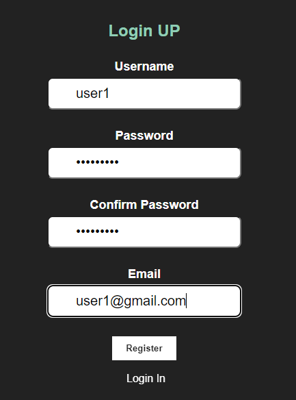
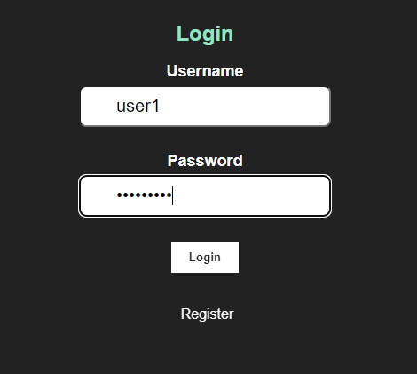
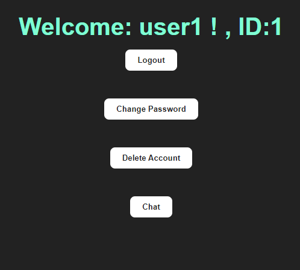
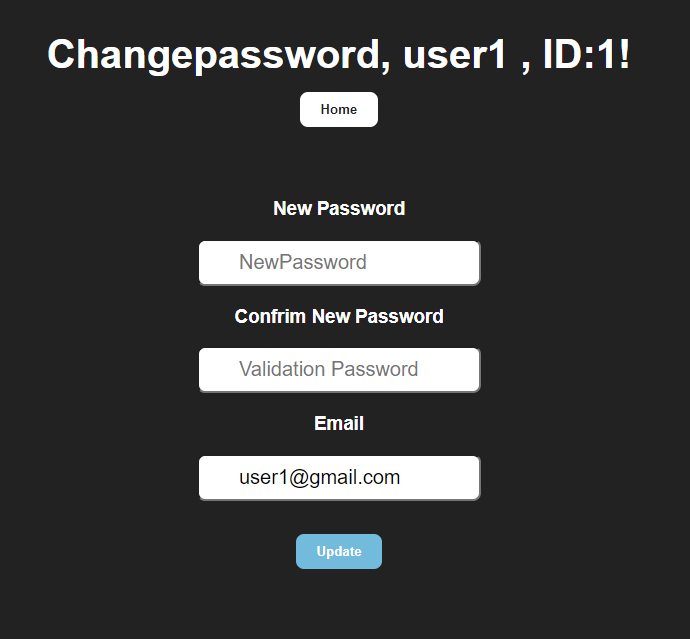

# Chat like Whatsapp Flask React Mysql 
Chat like Whatsapp Flask REST API with sqlalchemy mysql with React where there is a login and registration where each user can add contacts and send messages to each other. 

<p align="center">
  
</p>
<p align="center">
  
</p>


Video about his working : 
<p align="center">
  <a href="https://www.youtube.com/watch?v=jj1AFSLeBeo">
    
  </a>
</p>


---

<p align="justify">
First create an account where you must create a username, password ("Must include at least one number.", "Must include at least one lowercase letter,"Must include at least one lowercase letter.", "Must include at least one uppercase letter.", "Must include at least one uppercase letter.","Must include at least one uppercase letter.", "Must include at least one uppercase letter.", "Must include at least one uppercase letter.","Must include at least one special character.", "Must include at least one special character.", "Must include at least one special character.","The length of the password must be equal to or greater than 8 characters.","Must not contain blank spaces.") Confirm your password and enter an email address.
</p>

<p align="center">
  
</p>

<p align="justify">
In login enter your username and password, click on the "Login" button.
</p>

<p align="center">
  
</p>

<p align="justify">

After logging in you will see the home screen where you will see your user name and registration id, in this section you can log out, change your password, delete your account (delete your account ), and chat.
</p>

<p align="center">
  
</p>

<p align="justify">

In change password you can change your password and email if required.
</p>

<p align="center">
  
</p>

<p align="justify">
In chat you can add your contact with the id set in the login or "home" and you can add a name to the contact, when you click on the contact the chat made by the two users will come out, if you have not made a chat it will come out empty. At the bottom there is a text area where you can write the message to send by clicking on the "send" button.
</p>

<p align="center">
  
</p>

<p align="center">
  
</p>

<p align="center">
  
</p>

<p align="center">
  
</p>

<p align="center">
  
</p>
<p align="justify">
The tables are created according to their "id", i.e. for own contacts it is table_{id}.  i.e. for the own contacts it is table_{id} and for the chat between the two users it is table_{id}_{id_contact}. 

</p>

<p align="center">
  
</p>
<p align="center">
  
</p>

## Steps to implement it
Backend Options for do it: 

1. Use Dockerfile or docker-compose.yml
2. Use virtual enviroments and apply  requirements.txt 
```python
pip install -r requirements.txt
```
Use Docker 
```python
#Comands for use docker container mysql
docker run --name mymysql -e MYSQL_ROOT_PASSWORD=mypassword -p 3306:3306 -d mysql:latest

docker exec -it mymysql bash

#Inside of the container mysql
mysql -u root -p

create database flaskmysql;

```
Fronted React Options for do it:
1. Use Dockerfile or docker-compose.yml
2. Download dependencies and libraries
```python

#Download dependencies
 npm install 

#if you create the project from scratch with vite it would be:
npm create vite

#copy package.json of this project for dependencies and run this:   
npm install 
```